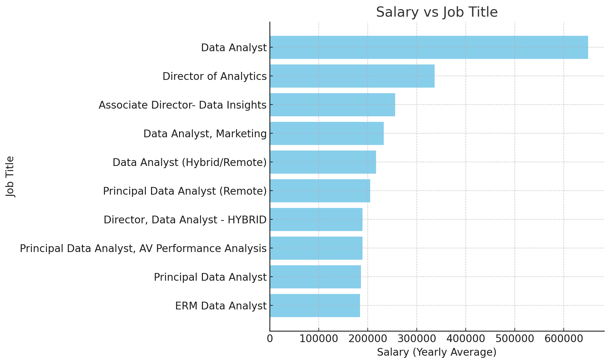
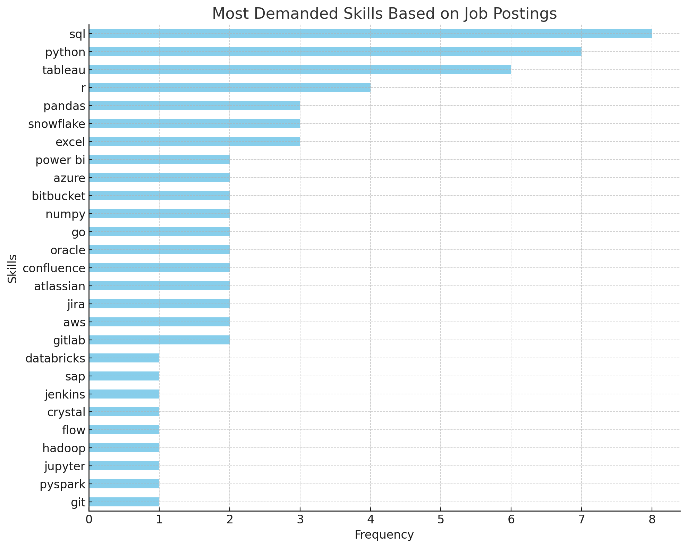
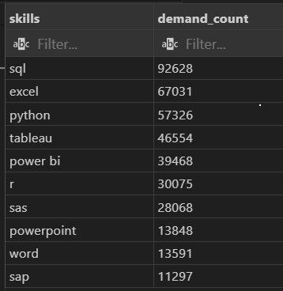
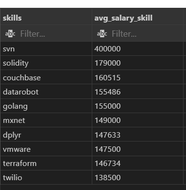
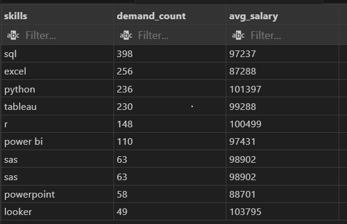

# Introduction
Welcome to my first project in my SQL portfolio, in this project I will be testing my SQL skills by filtering data that interests me about remote Data Analyst jobs abroad and the most in-demand and best-paid skills in the market, we will also briefly look at some data on jobs that interest me personally in countries of interest to me and see if this affects the type of skills that are in demand in the market for Data Analysts

Check out my SQL queries here: [project_sql folder](/project_sql/)


# Background

The reason why I did this project was to practice my SQL skills and at the same time know which skills would be most useful to me to be a competitive Data Analyst, thus taking into account the most in-demand and best-paid skills in the market.

The data for this analysis is from Luke Barousse’s  [SQL Course](https://lukebarousse.com/sql). This data includes details on job titles, salaries, locations, and required skills. 


### The questions I wanted to answer through my SQL queries were:
1. What are the top-paying data analyst jobs?
2. What skills are required for these top-paying jobs?
3. What skills are most in demand for data analysts?
4. Which skills are associated with higher salaries?
5. What are the most optimal skills to learn for a data analyst looking to maximize job market value?


# Tools I Used

### These were the tools I used to do this project

- **SQL** (Structured Query Language): Enabled me to interact with the database, extract insights, and answer my key questions through queries.

- **PostgreSQL**: As the database management system, PostgreSQL allowed me to store, query, and manipulate the job posting data.

- **Visual Studio Code:** This open-source administration and development platform helped me manage the database and execute SQL queries.

- **Git and Github:** To be able to share this project and have it stored for security and control


# The Analysis
Each query in this project aimed to investigate specific aspects of the data analyst job market. Below is how I addressed each point:

### 1. Top-paying jobs for Data Analyst
To identify the highest-paying roles, I filtered data analyst positions by average yearly salary and location, focusing on remote jobs. This query highlights the high paying opportunities in the field.

```sql
-- What are the top-paying jobs for my role?

--Top 10 highest paying data analyst roles (remote)

SELECT
    job_id,
    job_title,
    job_country,
    job_location,
    job_schedule_type,
    salary_year_avg,
    name AS company_name,
    job_posted_date
FROM 
    job_postings_fact
LEFT JOIN company_dim ON job_postings_fact.company_id = company_dim.company_id
WHERE
    job_title_short = 'Data Analyst' AND
    job_location = 'Anywhere' AND
    salary_year_avg IS NOT NULL 
ORDER BY
    salary_year_avg DESC
LIMIT 10;
```

These are the main points I discovered from these 10 highest-paying jobs in the field.
- **Salary range:** The annual salaries for these 10 positions range from $184,000 to $650,000, which means there is significant growth potential in the field.
- **Diverse companies:** Various types of companies in different sectors require data analysts, which means that there is a great need and interest in hiring Data Analysts in various sectors.
- **Variety of job titles:** It is also noted that there are different job titles for the positions offered, reflecting a wide variety of flexibility and specialization in the area.



*Bar graph showing salaries for the top 10 Data Analyst jobs (Generated by ChatGPT based on my query results)*

 ### For this question I additionally made 2 queries, one of which shows me data analyst jobs specifically from countries of interest to me and then another query about data analyst jobs for my home country.

 ```sql
 --Remote jobs from countries of interest to me

SELECT
    job_id,
    job_title,
    job_country,
    job_location,
    job_work_from_home,
    job_schedule_type,
    salary_year_avg,
    name AS company_name,
    job_posted_date
FROM 
    job_postings_fact
LEFT JOIN company_dim ON job_postings_fact.company_id = company_dim.company_id
WHERE
    job_country IN  ('Brazil','Argentina','Chile','Uruguay') AND
    job_title_short = 'Data Analyst' AND
    job_work_from_home IS TRUE
ORDER BY
    job_country;


--Remote and local jobs in my country

SELECT
    job_id,
    job_title,
    job_country,
    job_location,
    job_work_from_home,
    job_schedule_type,
    salary_year_avg,
    name AS company_name,
    job_posted_date
FROM 
    job_postings_fact
LEFT JOIN company_dim ON job_postings_fact.company_id = company_dim.company_id
WHERE
    job_country = 'Paraguay' AND
    job_title_short = 'Data Analyst';


/*From "Remote and local jobs in my country" and "Remote jobs from countries of 
interest to me" theres no info from salary_year_avg, that is why I don't put 
a condition in WHERE to filter the salaryes/*
 ```

When making these queries, I realized that there is no salary information on the jobs published in the countries of my interest and in my country, so for this question, these queries are not useful to us. Later, we will approach the next questions in the same way.
 
 ### 2. Skills for Top-Paying Jobs
To understand what skills are required for the top-paying jobs, I joined the job postings with the skills data, providing insights into what employers value for high-compensation roles.

 ```sql
/*Question: What skills are required for the top-paying data analyst jobs?*/

WITH top_paying_skills AS (
    SELECT
        job_id,
        job_title, 
        salary_year_avg,
        name AS company_name
    FROM 
        job_postings_fact
    LEFT JOIN company_dim ON job_postings_fact.company_id = company_dim.company_id
    WHERE
        job_title_short = 'Data Analyst' AND
        job_location = 'Anywhere' AND
        salary_year_avg IS NOT NULL 
    ORDER BY
        salary_year_avg DESC
    LIMIT 10
)

SELECT 
    top_paying_skills.*,
    skills
FROM top_paying_skills
INNER JOIN skills_job_dim ON top_paying_skills.job_id = skills_job_dim.job_id
INNER JOIN skills_dim ON skills_dim.skill_id = skills_job_dim.skill_id
ORDER BY
    salary_year_avg DESC
 ```
Here's the breakdown of the most demanded skills for data analysts in 2023, based on the top 10 job postings:

- **SQL** is leading with a bold count of 8.

- **Python** follows closely with a bold count of 7.

- **Tableau** is also highly sought after, with a bold count of 6.

- Other skills like **R, Snowflake, Pandas,** and **Excel** show varying degrees of demand.



*Bar graph showing the count of skills for the top 10 Data Analyst jobs (Generated by ChatGPT based on my query results)*


## Skills Required for "Remote jobs from countries of interest to me"

For the skills needed for the jobs offered in the countries I'm interested in, I had to shift my focus slightly since I couldn't search for the skills required for the top 10 highest-paying jobs. So I only looked for the most in-demand skills for all the remote jobs in the respective countries.

```sql
/*Question: What skills are required for "Remote jobs from countries of interest to me"?*/

--Remote jobs from countries of interest to me

WITH interesting_remote_jobs AS (
    SELECT
        job_id,
        job_title,
        job_country,
        name AS company_name
    FROM 
        job_postings_fact
    LEFT JOIN company_dim ON job_postings_fact.company_id = company_dim.company_id
    WHERE
        job_country IN  ('Brazil','Argentina','Chile','Uruguay') AND
        job_title_short = 'Data Analyst' AND
        job_work_from_home IS TRUE
    ORDER BY
        job_country
)


SELECT 
    interesting_remote_jobs.*,
    skills
FROM interesting_remote_jobs
INNER JOIN skills_job_dim ON interesting_remote_jobs.job_id = skills_job_dim.job_id
INNER JOIN skills_dim ON skills_dim.skill_id = skills_job_dim.skill_id
ORDER BY
    job_country ASC;
```
### Top 10 Most In-Demand Skills for Remote Data Analyst Roles (Based on 287 remote job postings from selected countries of interest)

- **SQL:** appears in 201 postings - 70.0%
- **Python:**  119 mentions - 41.5%
- **Power BI:**  110 mentions - 38.3%
- **Tableau:**  79 mentions - 27.5%
- **Excel:**  52 mentions - 18.1%
- **AWS:**  38 mentions - 13.2%
- **Looker:**  36 mentions - 12.5%
- **R:**  28 mentions - 9.8%
- **Airflow:**  22 mentions -	7.7%
- **Azure:**  20 mentions - 7.0% 

As you can see,  in "Remote jobs from countries of interest to me", **SQL** always leads as number 1, as well as **Excel, Power BI/Tableau** and **Python** always being on the top.

## Skills Required for "Remote and local jobs in my country"

```sql
/*Question: What skills are required for "Remote and local jobs in my country"?*/

--Remote and local jobs in my country

WITH remote_and_local_jobs AS (
    SELECT
        job_id,
        job_title,
        job_country,
        name AS company_name
    FROM job_postings_fact
    LEFT JOIN company_dim ON job_postings_fact.company_id = company_dim.company_id
    WHERE
        job_country = 'Paraguay' AND
        job_title_short = 'Data Analyst'
)

SELECT 
    remote_and_local_jobs.*,
    skills
FROM remote_and_local_jobs
INNER JOIN skills_job_dim ON remote_and_local_jobs.job_id = skills_job_dim.job_id
INNER JOIN skills_dim ON skills_dim.skill_id = skills_job_dim.skill_id
```
### Top 10 Most In-Demand Skills for Data Analyst Roles in Paraguay (Based on 15 (T-T) job postings from Paraguay)

- **SQL** appears in 6 postings - 40.0%
- **Excel** appears in 6 postings - 40.0%
- **Power BI** appears in 3 postings - 20.0%
- **Tableau** appears in 3 postings - 20.0%
- **SAP** appears in 3 postings - 20.0%
- **Word** appears in 3 postings - 20.0%
- **Python** appears in 2 postings - 13.3%
- **R** appears in 2 postings - 13.3%
- **MicroStrategy** appears in 2 postings - 13.3%
- **Spark** appears in 2 postings - 13.3% 

We can see that **SQL** also leads in this position, with **Excel, Power BI**, and **Tableau** consistently at the top, but we see **Python** pushed further down the list of skills.


### 3. Top Demanded Skills

This query helped identify the skills most frequently requested in job postings, directing focus to areas with high demand.

```SQL
/*Question: What are the 10 skills most in-demand for data analysts*/

-- Top 10 skills in-demand arround the world

SELECT
    skills,
    COUNT (skills_job_dim.job_id) AS demand_count
FROM
    skills_job_dim
INNER JOIN skills_dim ON skills_dim.skill_id = skills_job_dim.skill_id
INNER JOIN job_postings_fact ON job_postings_fact.job_id = skills_job_dim.job_id
WHERE
    job_title_short = 'Data Analyst'
GROUP BY
    skills
ORDER BY
    demand_count DESC
LIMIT 10;
```
Breakdown of the top 10 demanded skills for Data Analyst in 2023

- **SQL** and **Excel** again dominate the top, seeing that they are strong skills necessary for a Data Analyst, for data manipulation and analysis.
- **Power BI** and **Tableau** are consolidating as the most in-demand programs for data visualization.
- The most in-demand programming languages ​​to complement data analysis and perform automation are **Python** and **R**.
- In the last positions we have complementary programs such as **PowerPoint** and **Word**, as well as professional software such as **SAP** and **SAS**



*Table of the demand for the top 10 skills in Data Analyst job postings*


### 4. Top Paying Skills

Exploring the average salaries associated with different skills revealed which skills are the highest paying.

```sql
-- What are the top paying skills for 'Data Analyst'?

SELECT
    skills,
    ROUND (AVG (job_postings_fact.salary_year_avg), 0) AS avg_salary_skill
FROM
    skills_job_dim
INNER JOIN skills_dim ON skills_dim.skill_id = skills_job_dim.skill_id
INNER JOIN job_postings_fact ON job_postings_fact.job_id = skills_job_dim.job_id
WHERE
    job_title_short = 'Data Analyst' AND
    salary_year_avg IS NOT NULL
GROUP BY
    skills
ORDER BY
    avg_salary_skill DESC
LIMIT 10;
```
- **SVN** Dominates by a Wide Margin with an average salary of $400,000, svn (Apache Subversion) stands out strongly from the others. This may indicate high demand with a low supply of experts, or data outliers.

- **Emerging and Niche Technologies Also Stand Out:** Skills like **Solidity** (for smart contracts on blockchain) and **DataRobot** (AutoML platform) have high average salaries, suggesting that specializing in emerging technologies can be very profitable.

- **High-Paying Infrastructure and DevOps Tools**: Terraform, VMware, and Couchbase are on the list, showing that infrastructure-related skills such as code and virtualization remain in high demand for technical roles.

- **Where is SQL? T.T**




*Table of the average salary for the top 10 paying skills for Data Analyst*


### 5. Optimal Skills

Combining insights from demand and salary data, this query aimed to pinpoint skills that are both in high demand and have high salaries, offering a strategic focus for skill development.

```sql
/* Answer: What are the most optimal skills to learn (aka it’s in high demand and a high-paying skill) 
for a data analyst?*/


WITH top_demanded_skills AS (
    SELECT
        skills_job_dim.skill_id,
        COUNT (skills_job_dim.job_id) AS demand_count
    FROM
        skills_job_dim
    INNER JOIN job_postings_fact ON job_postings_fact.job_id = skills_job_dim.job_id
    WHERE
        job_title_short = 'Data Analyst' AND
        salary_year_avg IS NOT NULL AND
        job_work_from_home IS TRUE
    GROUP BY
        skill_id
),
top_paying_skills AS (
    SELECT
        skills_job_dim.skill_id,
        AVG (job_postings_fact.salary_year_avg) AS avg_salary_skill
    FROM
        skills_job_dim
    INNER JOIN job_postings_fact ON job_postings_fact.job_id = skills_job_dim.job_id
    WHERE
        job_title_short = 'Data Analyst' AND
        salary_year_avg IS NOT NULL AND
        job_work_from_home IS TRUE
    GROUP BY
        skills_job_dim.skill_id
)
SELECT
    skills_dim.skills,
    top_demanded_skills.demand_count,
    ROUND (top_paying_skills.avg_salary_skill,0) AS avg_salary
FROM top_demanded_skills
INNER JOIN top_paying_skills ON top_paying_skills.skill_id = top_demanded_skills.skill_id
INNER JOIN skills_dim ON top_paying_skills.skill_id = skills_dim.skill_id
WHERE
    demand_count > 10
ORDER BY
    top_demanded_skills.demand_count DESC,
    avg_salary DESC
LIMIT 10;
```

- **SQL Leads in Total Demand:** With 398 job postings, **SQL** is clearly the most sought-after skill. Although its average salary isn't the highest ($97,237), its massive presence makes it a fundamental skill for any data analyst or tech professional.

- **Excel Remains Relevant:** Although often considered "basic," **Excel** appears in 256 job postings. Its salary ($87,288) is the lowest, but its high demand indicates that it remains key in corporate and reporting jobs.

- **Python and R Offer an Excellent Combination:** **Python** and **R** have high salaries ($101,397 and $100,499) with medium-high demand, making them very profitable tools to learn for data analyst, statistical analysis, and automation.

- **Visualization tools:** **Tableau, Power BI**, and **Looker** are in high demand and have competitive salaries.
**Looker** has the highest salary ($103,795), although in low demand. **Power BI** has lower salaries but also less competition.




*Table of the most optimal skills for data analsyt sorted by salary and demand*


# General Insigth

From the analysis, several general insights emerged:

1. **Top-Paying Data Analyst Jobs**: The highest-paying jobs for data analysts that allow remote work offer a wide range of salaries, the highest at $650,000!
2. **Skills for Top-Paying Jobs**: High-paying data analyst jobs require advanced proficiency in SQL, suggesting it’s a critical skill for earning a top salary.
3. **Most In-Demand Skills**: SQL is also the most demanded skill in the data analyst job market, thus making it essential for job seekers.
4. **Skills with Higher Salaries**: Specialized skills, such as SVN and Solidity, are associated with the highest average salaries, indicating a premium on niche expertise.
5. **Optimal Skills for Job Market Value**: SQL leads in demand and offers for a high average salary, positioning it as one of the most optimal skills for data analysts to learn to maximize their market value.
6. **Global Required Skills:** The same pattern of skill demand is repeated in virtually every country, with SQL always being the number 1 skill followed by Excel, Phyton, and Power BI/Tableau.

# What I Learned
In this project I put to the test what I had learned about SQL and some non-technical skills such as:

- **Query Construction**: Learning to build advanced SQL queries that combine multiple tables and employ functions like **`WITH`** clauses for temporary tables.

- **Data Aggregation**: Utilizing **`GROUP BY`** and aggregate functions like **`COUNT()`** and **`AVG()`** to summarize data effectively.

- **Analytical Thinking**: Developing the ability to translate real-world questions into actionable SQL queries that got insightful answers.

- **Workflow:** I learned how to upload data to a local server and got a sense of how work is done in the "real world" using tools like VSCode and Git to carry out processes step by step and in a controlled manner.

- **Creation of Projects on GitHub:** As it is my first project, I learned to have my repository on GitHub so I can share my projects with the community and know how each aspect of the page works.


# Conclusions
This project tested my skills (and patience, hehe) in creating SQL queries and my critical thinking when trying to obtain the information I needed. This allowed me to discover valuable information for the most optimal skills as a Data Analyst. This serves as a great learning path for people who want to pursue a career as a Data Analyst and use their time as efficiently as possible. It also made me really want to delve deeper into this world, encouraging me to continue learning more about useful tools for the market.